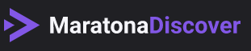

<h4 align="center" width="250px> 
	 Blog with Next.Js 
</h4>

	
  
	
  
  
  

  
   

---

<small>Projeto Dev Finance$ Criado durante a Maratona Discover
Promovido pela [Rocketseat](https://rocketseat.com.br/)</small>
 
<small>Instrutor <strong>Mayk Brito</strong></small>

---

<h3>Feito algumas modificações</h3>

- Dark Mode com mudança suave
- Mudança de Cor no Display Valor total de acordo com o saldo positivo ou negativo
- Favicon
- Sombra colorida ao passar o mouse para Excluir uma entrada
- Logo da Maratona Discover

